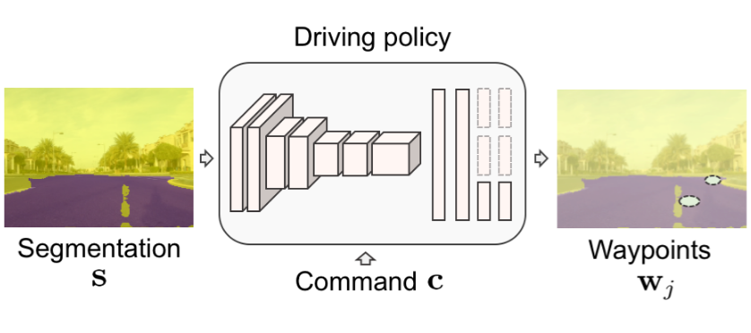

# 2019.5.10

## 一、对paper中task相关部分的理解和分析

> We would like to reproduce the segmentation-policy architecture referred in the paper above.

### (1)

[论文](https://arxiv.org/abs/1804.09364)中关于*segmentation-policy*的部分是在**3.Method-Driving policy**中，大意是要使用**CIL（Conditional Imitation Learning）**来从Perception（segmentation）中学习得到Waypoint（policy）

训练过程可被表示为：
$$
\theta^{*} = arg\min_{\theta} \sum_il(F(o_i,c_i,\theta), a_i)
$$
其中：

- $F$：CIL 网络
- $o$：*observation* - 分割为road/非road的图片(编码为2-channel img)
- $c$：*command* - (left,right,straight)中的某一个指令
- $\theta$：*learnable-params*
- $l$：均方差损失（MSE）
- $a$：*action* - waypoint（表示为<$\varphi_1$,$\varphi_2$>)

### (2)

根据[论文](https://arxiv.org/abs/1710.02410)对CIL网络结构(b)（本task中需要实现的结构）的介绍：

observation $o = <i,m>$，其中$i$代表img，$m$是img的低维向量表示。

1. $i$通过一个*image module*（convolutional network）后得到特征向量$ I(i)$，$m$通过一个*measurement module*（fully-connected network）后得到特征向量$ M(m)$
2. $I(i)$和$M(m)$连接得到向量$j$
3. 根据command $c$的具体值，把$j$ switch到对应的branch（small fully-connected network），得到$a$

## 二、对要做的工作的分析

1. 搞清楚[coiltrain](https://github.com/gy20073/coiltraine)中与task有关部分的调用逻辑，看看pytorch

2. 搞清楚dataset的格式，包含的数据都有哪些？是什么形式？怎么用？

3. 利用[ERFNet](https://github.com/adrshm91/erfnet_pytorch)获取segmentation

4. 确定后续使用的segmentation的形式（img or img&vector ?)

5. 参考[imitation-learning](https://github.com/carla-simulator/imitation-learning)实现CIL（ 1 shared convolutional encoder + 3 small fully-connected branch network）

6. 训练网络

   

   