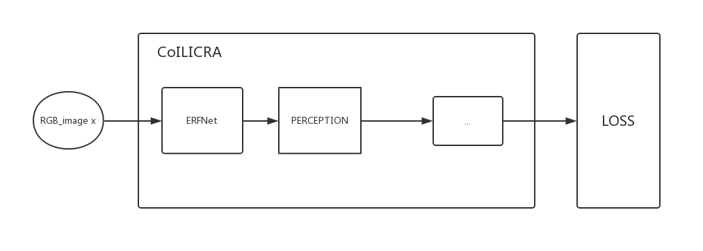
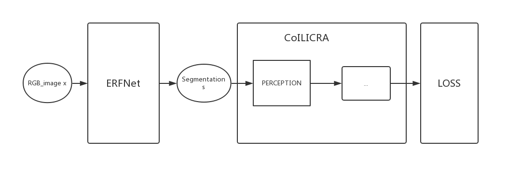

# 2019.5.13

## 一、对之前拟定的工作的回顾

经过进一步仔细查看代码后，我认为关于branch和loss的部分应该不用改，目前的代码中，`train.py`中使用的是L1 loss和forward，但在`validate.py`中使用的是MSE loss和foward_branch：

```python
# train.py
branches = model(torch.squeeze(data['rgb'].cuda()),
                             dataset.extract_inputs(data).cuda())
            loss_function_params = {
                'branches': branches,
                'targets': dataset.extract_targets(data).cuda(),
                'controls': controls.cuda(),
                'inputs': dataset.extract_inputs(data).cuda(),
                'branch_weights': g_conf.BRANCH_LOSS_WEIGHT,
                'variable_weights': g_conf.VARIABLE_WEIGHT
            }
            loss, _ = criterion(loss_function_params)# L1 in coil_icra.yaml
            loss.backward()
            
# validate.py
	output = model.forward_branch(torch.squeeze(data['rgb']).cuda(),
                                                  dataset.extract_inputs(data).cuda(),
                                                  controls)
    ...

    mse = torch.mean((output -
                      dataset.extract_targets(data).cuda())**2).data.tolist()
    mean_error = torch.mean(
                    torch.abs(output -
                              dataset.extract_targets(data).cuda())).data.tolist(
```

而且在train时，在计算loss时，先计算了control_mask，这样后续计算时非direction对应的branch输出都是0，不会在反向传播时影响网络参数：

```python
# network/loss.py
def branched_loss(loss_function, params):
    controls_mask = LF.compute_branches_masks(params['controls'],
                                              params['branches'][0].shape[1])
    # Update the dictionary to add also the controls mask.
    params.update({'controls_mask': controls_mask})

    # calculate loss for each branch with specific activation
    loss_branches_vec, plotable_params = loss_function(params)

    ...

```

所以，我认为branch和loss相关的部分应该不需要做改动，这样的话工作表就做以下变更：

| 需要变更的部分                           | 需要变更为                                                   | 方法                                                         | 变化   |
| ---------------------------------------- | ------------------------------------------------------------ | ------------------------------------------------------------ | ------ |
| 输入的Image不能是3-channel RGB           | 区分为road/非road的2-channel segmentation                    | 使用在Cityscapes dataset上训练好的ERFNet，将RGB进行分割，并且要把分割结果进行选择性合并（区分road） |        |
| 输出不能是5个branch                      | 要使用CIL的branched architecture，根据control输出对应的1个branch | 使用forward_branch()                                         | 不改动 |
| 目前使用的是L1 loss                      | 使用MSE loss（L2 loss）                                      | Loss（'L2'）                                                 | 不改动 |
| 输出不能是['steer', 'throttle', 'brake'] | waypoint angle                                               | *待定                                                        |        |
| 输出single branch后loss函数可能要改      | *待定                                                        | *待定                                                        | 不改动 |

## 二、工作尝试

按照更新后的工作表内容进行了以下尝试：

1. 将CoILIRA net的输出改为waypoint angle —— **失败**
2. 使用ERFNet对RGB进行分割——**可运行，但是输出结果诡异**

## 三、对具体尝试的记录和分析

### （1）输出waypoint angle

####  猜想[1]: waypoint angle被表示为一个float

在`validate.py`的`excute`函数中，我发现有：

```python
		# It could be either waypoints or direct control
        if 'waypoint1_angle' in g_conf.TARGETS:
            write_waypoints_output(checkpoint_iteration, output)
        else:
            write_regular_output(checkpoint_iteration, output)

```

再看`write_waypoints_output`，可以判断*‘waypoint1_angle‘*是一个float，它与*'steer', 'throttle', 'brake'*一起作为target，并根据angel来确定输出的streer:

```python
def write_waypoints_output(iteration, output):

    for i in range(g_conf.BATCH_SIZE):
        steer = 0.7 * output[i][3]

        if steer > 0:
            steer = min(steer, 1)
        else:
            steer = max(steer, -1)

        coil_logger.write_on_csv(iteration, [steer,
                                            output[i][1],
                                            output[i][2]])
```

检索了一下.yaml文件之后发现确实和我猜想的一样：

```yaml
# config/eccv/experiment.yaml
TARGETS: ['steer', 'throttle', 'brake', 'waypoint1_angle', 'waypoint2_angle']
```

#### 猜想[2]：json中的waypoint angle为[angle, v, r]形式

观察json中的key，我认为可能有关的属性有：

```json
	"playerMeasurements": {
        ...
        "transform": {
            "location": {
                "x": 46.15003204345703,
                "y": 326.9700927734375,
                "z": 38.10350036621094
            },
            "orientation": {
                "x": -1.0,
                "y": 1.7881393432617188e-06,
                "z": 5.006789706385462e-06
            },
            "rotation": {
                "pitch": 0.0002868679293897003,
                "roll": -0.0003662109375,
                "yaw": 179.99989318847656
            }
        }
    },
    ...
    "waypoints": [
        [
            -0.00021999999999877673,
            317.75597999999997,
            38.11
        ],
        [
            0.13631122513370642,
            318.3289427067225,
            38.11
        ],
        [
            0.26086482064013694,
            318.86865633642,
            38.11
        ],
        ...
    ]
```

看到waypoints项中有不同的子项，并且最后一个都是38.11，联系到paper中提到的固定$r_1=5$和$r_2=20$

，我猜想最后一项是distance $r_j$，这样的话前两项就是$\varphi_j$和$v$。

但是为什么一帧有这么多个waypoint呢？而且$\varphi_j$和$v$到底哪个对应哪个呢？

#### 猜想[3]：json中的waypoint angle为[x,y,z]形式

由于一帧有好几个waypoints，我猜想了可能表示车辆在一帧时间内的连续位置，这样的话angle就是point0和point1之间的夹角，于是我就做了这样的尝试

```python
1. TARGET -> ["waypoint1_angle"]
2. data['waypoint1_angle'] -> angle<point0, point1> = atan(dy/dx)
3. foward() -> output angle
```

做了这样的改动之后，因为dx会出现0，这时我就输出angle为90/-90，但是这样突变的数据显然是错误的，因为出现loss不能收敛的情况


由于以上猜想都无法很好的验证，我就向老师咨询了json中waypoint的format，暂时停止改动

### （2）使用ERFNet对RGB进行分割

参考erfnet_pytorch/eval中的代码，我尝试整合pretrained ERFNet到项目中

首先，将erfnet.py拷贝到network/models/目录下，然后就需要确定应该把erfnet放在整个pipeline的哪个部分

#### 猜想[1]: 将ERFNet加入到coil model的foward module中

由于pretrained ERFNet实在cityscapes dataset上训练的，我一开始的时候认为需要再使用coil dataset进行训练，但是由于没有segmentation的ground truth，所以只能把ERFNet植入到CoIL Net中，进行End-to-End训练，即：



但是这样有一些问题：

1. ERFNet输出的图像20-class的分割结果，但是我们只想要road/not_road 2-class，如果硬分离输出2-class结果，就会导致梯度流断掉，ERFNet中的parameter无法被训练
2. 这个End-to-End的方法不符合paper中强调的modularity

#### 猜想[2]: 将ERFNet作为一个单独的module

如果把按照paper中的描述，把ERFNet当作一个单独的Perception模块，那就需要把rgb传入ERFNet得到segmentation，然后再把segmentation输入CoIL Net，即：



这样的话我需要做的就只是整合ERFNet，但是我觉得这样也有点问题：

1. ERFNet是在cityscapes上train的，那个数据集的图片是真实场景，而且比CoIL dataset中的图片大很多，不能保证在我们的图片中也有准确的分割的效果
2. cityscapes的dataloader和CoIL的不同，可能还需要迁移对data的处理
3. 将20-class变为2-class这样感觉上有点粗暴，是否需要在cityscapes上训练一个尺寸为88*200的2-class的ERFNet呢？
4. 目前粗略的跑了一下，出的分割结果非常诡异，有的是全0，有的是0，1，0，1交替，可以肯定中间哪里出了问题，就是不知道是code的问题还是ERFNet不适用

### （3）cityscapes dataset

根据`cityscapesScripts/cityscapesscripts/helpers/labels.py`中的labels的定义，road的trainId是0，所以把ERFNet输出取label为0的部分即是road

```python
labels = [
    #       name                     id    trainId   category            catId     hasInstances   ignoreInEval   color
    Label(  'unlabeled'            ,  0 ,      255 , 'void'            , 0       , False        , True         , (  0,  0,  0) ),
    Label(  'ego vehicle'          ,  1 ,      255 , 'void'            , 0       , False        , True         , (  0,  0,  0) ),
    Label(  'rectification border' ,  2 ,      255 , 'void'            , 0       , False        , True         , (  0,  0,  0) ),
    Label(  'out of roi'           ,  3 ,      255 , 'void'            , 0       , False        , True         , (  0,  0,  0) ),
    Label(  'static'               ,  4 ,      255 , 'void'            , 0       , False        , True         , (  0,  0,  0) ),
    Label(  'dynamic'              ,  5 ,      255 , 'void'            , 0       , False        , True         , (111, 74,  0) ),
    Label(  'ground'               ,  6 ,      255 , 'void'            , 0       , False        , True         , ( 81,  0, 81) ),
    Label(  'road'                 ,  7 ,        0 , 'flat'            , 1       , False        , False        , (128, 64,128) ),
    Label(  'sidewalk'             ,  8 ,        1 , 'flat'            , 1       , False        , False        , (244, 35,232) ),
    Label(  'parking'              ,  9 ,      255 , 'flat'            , 1       , False        , True         , (250,170,160) ),
    Label(  'rail track'           , 10 ,      255 , 'flat'            , 1       , False        , True         , (230,150,140) ),
    Label(  'building'             , 11 ,        2 , 'construction'    , 2       , False        , False        , ( 70, 70, 70) ),
    Label(  'wall'                 , 12 ,        3 , 'construction'    , 2       , False        , False        , (102,102,156) ),
    Label(  'fence'                , 13 ,        4 , 'construction'    , 2       , False        , False        , (190,153,153) ),
    Label(  'guard rail'           , 14 ,      255 , 'construction'    , 2       , False        , True         , (180,165,180) ),
    Label(  'bridge'               , 15 ,      255 , 'construction'    , 2       , False        , True         , (150,100,100) ),
    Label(  'tunnel'               , 16 ,      255 , 'construction'    , 2       , False        , True         , (150,120, 90) ),
    Label(  'pole'                 , 17 ,        5 , 'object'          , 3       , False        , False        , (153,153,153) ),
    Label(  'polegroup'            , 18 ,      255 , 'object'          , 3       , False        , True         , (153,153,153) ),
    Label(  'traffic light'        , 19 ,        6 , 'object'          , 3       , False        , False        , (250,170, 30) ),
    Label(  'traffic sign'         , 20 ,        7 , 'object'          , 3       , False        , False        , (220,220,  0) ),
    Label(  'vegetation'           , 21 ,        8 , 'nature'          , 4       , False        , False        , (107,142, 35) ),
    Label(  'terrain'              , 22 ,        9 , 'nature'          , 4       , False        , False        , (152,251,152) ),
    Label(  'sky'                  , 23 ,       10 , 'sky'             , 5       , False        , False        , ( 70,130,180) ),
    Label(  'person'               , 24 ,       11 , 'human'           , 6       , True         , False        , (220, 20, 60) ),
    Label(  'rider'                , 25 ,       12 , 'human'           , 6       , True         , False        , (255,  0,  0) ),
    Label(  'car'                  , 26 ,       13 , 'vehicle'         , 7       , True         , False        , (  0,  0,142) ),
    Label(  'truck'                , 27 ,       14 , 'vehicle'         , 7       , True         , False        , (  0,  0, 70) ),
    Label(  'bus'                  , 28 ,       15 , 'vehicle'         , 7       , True         , False        , (  0, 60,100) ),
    Label(  'caravan'              , 29 ,      255 , 'vehicle'         , 7       , True         , True         , (  0,  0, 90) ),
    Label(  'trailer'              , 30 ,      255 , 'vehicle'         , 7       , True         , True         , (  0,  0,110) ),
    Label(  'train'                , 31 ,       16 , 'vehicle'         , 7       , True         , False        , (  0, 80,100) ),
    Label(  'motorcycle'           , 32 ,       17 , 'vehicle'         , 7       , True         , False        , (  0,  0,230) ),
    Label(  'bicycle'              , 33 ,       18 , 'vehicle'         , 7       , True         , False        , (119, 11, 32) ),
    Label(  'license plate'        , -1 ,       -1 , 'vehicle'         , 7       , False        , True         , (  0,  0,142) ),
]

```


## 四、总结

今天进行了很多猜想，也尝试实现了一些猜想，但是很可惜结果都很不理想，所以向老师提出了一些疑问，还没有得到回复，明天根据和老师讨论的结果再确定下一步的工作

