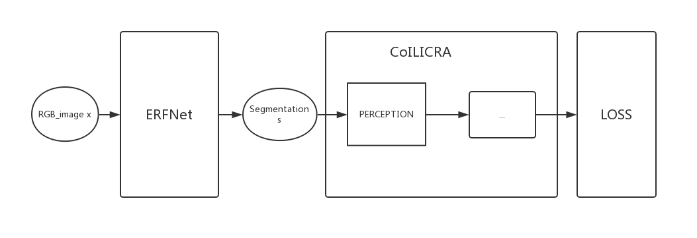
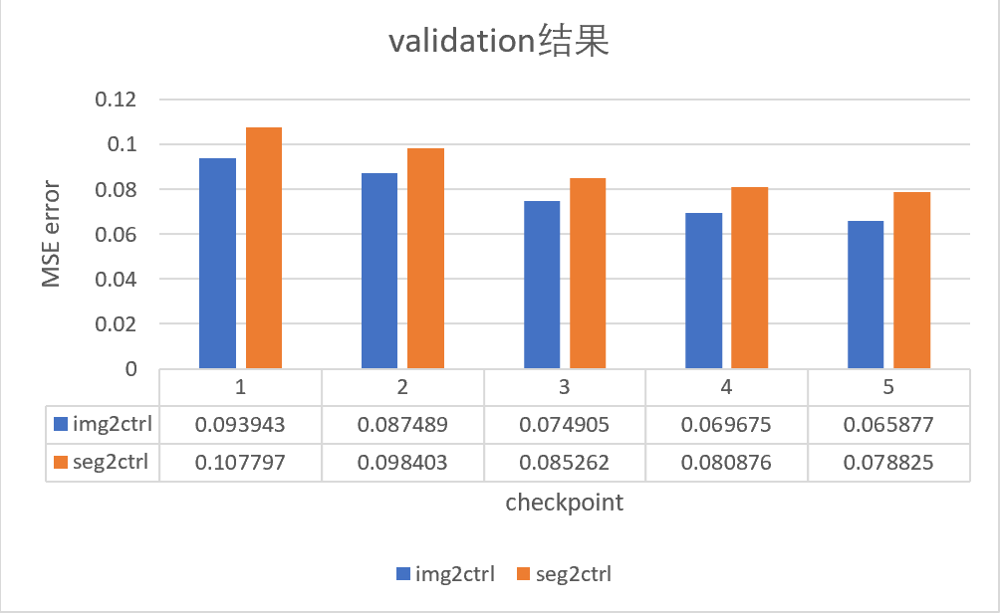

# IIIS-Test Report

- 上海交通大学  罗宇辰
- 项目时间：2019/5/10 - 2019/5/16

------

 在过去的一周内，我尝试了基于[codebase](https://github.com/gy20073/coiltraine)实现论文[*“Driving Policy Transfer via Modularity and Abstraction ”*](https://arxiv.org/abs/1804.09364)中的*segmentation-policy* 架构。为了完成这项工作，我经历了***“ 理解论文思想->理解项目架构和逻辑->提出解决方法的猜想->编码 &Debug->测试->交付 ”*** 的整个流程，虽然没有完美地完成任务，但是对于科研工作和项目有了一些感受和理解。

以下是我的工作报告。

## Step 1. 阅读论文

### 1. Driving Policy Transfer via Modularity and Abstraction

#### 1.1 整体思想

这篇论文中提出了一种通过模块化和抽象将驾驶策略从模拟环境迁移到现实环境的方法，主要的pipeline如下图所示：


三个module主要完成以下工作：

- **Perception module**：把sensor提取的RGB照片进行分割，区分出照片中的道路，输出road/not road的2-channel segmentation
- **Driving policy module**：根据segmentation和command输出驾驶策略，具体形式为道路上的位置点（waypoints）
- **Controller**：把waypoints转化为具体的车辆操纵方法

#### 1.2 Perception module

将RGB转化为segmentation主要目的是去除干扰因素，只保留与驾驶相关的关键信息

这一工作是通过一个Encoder-Decoder网络实现的，论文中提到基于*Cityscapes dataset*训练的的**ERFNet**很适用于这项工作

#### 1.3 Driving policy

使用**CIL（Conditional Imitation Learning）**来从segmentation中学习得到waypoint，训练过程可被表示为：
$$
\theta^{*} = arg\min_{\theta} \sum_il(F(o_i,c_i,\theta), a_i)
$$
其中：

- $F$：CIL 网络
- $o$：*observation* - 分割为road/非road的图片(编码为2-channel img)
- $c$：*command* - (left, right, straight)中的某一个指令
- $\theta$：*learnable-params*
- $l$：均方差损失（MSE）
- $a$：*action* - waypoint（表示为<$\varphi_1$,$\varphi_2$>)

### 2. End-to-end Driving via Conditional Imitation Learning

为了进一步了解Conditional Imitation Learning，我也读了这篇paper

论文中介绍了两种CIL网络结构：**command input **/ **branched**，这两种结构的区别在于command是作为一个输入还是作为一个branch选择器：


要实现的项目中是使用的是branched架构的CIL

## Step 2. 从codebase代码中理解项目逻辑和数据流

由于之前从来没有做过与Network有关的project，所以这项工作对我来说是个不小的挑战，花了差不多一整天才理解清楚整个数据流和代码逻辑。之前对pytorch也不熟悉，通过看代码对pytorch的使用也有了一些了解。

### 1. Data

#### 1.1 COIL_DATASET

数据集中的数据形式为`png图片`+`json文件`

```
|- dataset dir
|-|- episode_0 dir
|-|- ...
|-|- episode_M dir
|-|-|- IMG_0(Central_RGB_0/Left_RGB_0/Right_RGB_0).png
		+ measurement_0.json
|-|-|- ...
|-|-|- IMG_N(Central_RGB_N/Left_RGB_N/Right_RGB_N).png
		+ measurement_N.json
|-|-|- ...
|-|- ...

```

其中，第M episode中第N号的：

- **图片**：包括左/中/右三个view下的拍摄结果，为3-channel RGB图片，尺寸为$80*200$
- **json file**：记录了一些参数和网络预测结果的ground truth

#### 1.2 COIL data

dataloader从数据集中读取数据后，经过一些transform和augment之后把数据格式化输出为字典形式data

分析后，我判断data中核心的参数有：

```c
data
{
	// Image i
    'rgb':(3,88,200) 
    // Measurement m
    'speed_module':float 
    // Command/Control c
    'direction': float //2 - follow lane; 3 - turn left; 4 - turn right; 5 - go straight
	// Action a
	'steer', 'throttle', 'brake': float 
}
```

### 2. CoILICRA Net

codebase中实现了branched CIL网络骨架——`CoILICRA model`，主要由以下module组成：

- **perception** ：处理image，得到$I(i)$
- **measurement** ：处理measurement（speed），得到$M(m)$
- **join** ：将$I(i)$和M$(m)$连接，得到$j$
- **speed_branch**：处理image，但是使用speed进行梯度求导（？这里理解不是很清楚）
- **branches**：每个direction对应一个branch，共4个，处理$j$

每个module的具体形式和使用的参数（如kernel size等）在配置文件`config/sample/coil_icra.yaml`中有详细记录

`CoILICRA`的架构可以表示为：


- `foward`的output为**5**个branch各自输出的`['steer', 'throttle', 'brake']`的集合
- data中的control/direction信息没有被用在`foward`过程中，而是用在了`loss`的计算中

### 3. ERFNet

[erfnet_pytorch](https://github.com/adrshm91/erfnet_pytorch)中实现了ERFNet的架构：


ERFNet训练使用的数据集是cityscapes，所以输出的是20-class labels，具体的class id - category对应关系如下，可以看到road对应的label是0：

```python
labels = [
    #       name                     id    trainId   category            catId     hasInstances   ignoreInEval   color
    Label(  'unlabeled'            ,  0 ,      255 , 'void'            , 0       , False        , True         , (  0,  0,  0) ),
    Label(  'ego vehicle'          ,  1 ,      255 , 'void'            , 0       , False        , True         , (  0,  0,  0) ),
    Label(  'rectification border' ,  2 ,      255 , 'void'            , 0       , False        , True         , (  0,  0,  0) ),
    Label(  'out of roi'           ,  3 ,      255 , 'void'            , 0       , False        , True         , (  0,  0,  0) ),
    Label(  'static'               ,  4 ,      255 , 'void'            , 0       , False        , True         , (  0,  0,  0) ),
    Label(  'dynamic'              ,  5 ,      255 , 'void'            , 0       , False        , True         , (111, 74,  0) ),
    Label(  'ground'               ,  6 ,      255 , 'void'            , 0       , False        , True         , ( 81,  0, 81) ),
    Label(  'road'                 ,  7 ,        0 , 'flat'            , 1       , False        , False        , (128, 64,128) ),
    Label(  'sidewalk'             ,  8 ,        1 , 'flat'            , 1       , False        , False        , (244, 35,232) ),
    Label(  'parking'              ,  9 ,      255 , 'flat'            , 1       , False        , True         , (250,170,160) ),
    Label(  'rail track'           , 10 ,      255 , 'flat'            , 1       , False        , True         , (230,150,140) ),
    Label(  'building'             , 11 ,        2 , 'construction'    , 2       , False        , False        , ( 70, 70, 70) ),
    Label(  'wall'                 , 12 ,        3 , 'construction'    , 2       , False        , False        , (102,102,156) ),
    Label(  'fence'                , 13 ,        4 , 'construction'    , 2       , False        , False        , (190,153,153) ),
    Label(  'guard rail'           , 14 ,      255 , 'construction'    , 2       , False        , True         , (180,165,180) ),
    Label(  'bridge'               , 15 ,      255 , 'construction'    , 2       , False        , True         , (150,100,100) ),
    Label(  'tunnel'               , 16 ,      255 , 'construction'    , 2       , False        , True         , (150,120, 90) ),
    Label(  'pole'                 , 17 ,        5 , 'object'          , 3       , False        , False        , (153,153,153) ),
    Label(  'polegroup'            , 18 ,      255 , 'object'          , 3       , False        , True         , (153,153,153) ),
    Label(  'traffic light'        , 19 ,        6 , 'object'          , 3       , False        , False        , (250,170, 30) ),
    Label(  'traffic sign'         , 20 ,        7 , 'object'          , 3       , False        , False        , (220,220,  0) ),
    Label(  'vegetation'           , 21 ,        8 , 'nature'          , 4       , False        , False        , (107,142, 35) ),
    Label(  'terrain'              , 22 ,        9 , 'nature'          , 4       , False        , False        , (152,251,152) ),
    Label(  'sky'                  , 23 ,       10 , 'sky'             , 5       , False        , False        , ( 70,130,180) ),
    Label(  'person'               , 24 ,       11 , 'human'           , 6       , True         , False        , (220, 20, 60) ),
    Label(  'rider'                , 25 ,       12 , 'human'           , 6       , True         , False        , (255,  0,  0) ),
    Label(  'car'                  , 26 ,       13 , 'vehicle'         , 7       , True         , False        , (  0,  0,142) ),
    Label(  'truck'                , 27 ,       14 , 'vehicle'         , 7       , True         , False        , (  0,  0, 70) ),
    Label(  'bus'                  , 28 ,       15 , 'vehicle'         , 7       , True         , False        , (  0, 60,100) ),
    Label(  'caravan'              , 29 ,      255 , 'vehicle'         , 7       , True         , True         , (  0,  0, 90) ),
    Label(  'trailer'              , 30 ,      255 , 'vehicle'         , 7       , True         , True         , (  0,  0,110) ),
    Label(  'train'                , 31 ,       16 , 'vehicle'         , 7       , True         , False        , (  0, 80,100) ),
    Label(  'motorcycle'           , 32 ,       17 , 'vehicle'         , 7       , True         , False        , (  0,  0,230) ),
    Label(  'bicycle'              , 33 ,       18 , 'vehicle'         , 7       , True         , False        , (119, 11, 32) ),
    Label(  'license plate'        , -1 ,       -1 , 'vehicle'         , 7       , False        , True         , (  0,  0,142) ),
]

```

## Step 3. 提出猜想并尝试验证

在对比了论文中描述的实现和codebase中的实现后，我初步拟定了如下需要改动的部分：

| 序号 | 需要变更的部分                           | 需要变更为                                                   | 方法                                                         |
| ---- | ---------------------------------------- | ------------------------------------------------------------ | ------------------------------------------------------------ |
| #1   | 目前使用的是L1 loss                      | 使用MSE loss（L2 loss）                                      | Loss（'L2'）                                                 |
| #2   | 输出不能是5个branch                      | 要使用CIL的branched architecture，根据control输出对应的1个branch | 使用forward_branch()                                         |
| #3   | 输出single branch后loss函数可能要改      | *待定                                                        | *待定                                                        |
| #4   | 输出不能是['steer', 'throttle', 'brake'] | waypoint angle                                               | *待定                                                        |
| #5   | 输入的Image不能是3-channel RGB           | 区分为road/非road的2-channel segmentation                    | 使用在Cityscapes dataset上训练好的ERFNet，将RGB进行分割，并且要把分割结果进行选择性合并（区分road） |

### 1. Branch & Loss

最初我只注意到有`foward`和`forward_branch`两个方法，就认为branched CIL要调用的是`forward_branch`

经过进一步仔细查看代码后，我认为关于branch和loss的部分应该不用改，因为虽然`train.py`中使用的是L1 loss和forward，但在`validate.py`中使用的是MSE loss和foward_branch：

```python
# train.py
branches = model(torch.squeeze(data['rgb'].cuda()),
                             dataset.extract_inputs(data).cuda())
            loss_function_params = {
                'branches': branches,
                'targets': dataset.extract_targets(data).cuda(),
                'controls': controls.cuda(),
                'inputs': dataset.extract_inputs(data).cuda(),
                'branch_weights': g_conf.BRANCH_LOSS_WEIGHT,
                'variable_weights': g_conf.VARIABLE_WEIGHT
            }
            loss, _ = criterion(loss_function_params)# L1 in coil_icra.yaml
            loss.backward()
            
# validate.py
	output = model.forward_branch(torch.squeeze(data['rgb']).cuda(),
                                                  dataset.extract_inputs(data).cuda(),
                                                  controls)
    ...

    mse = torch.mean((output -
                      dataset.extract_targets(data).cuda())**2).data.tolist()
    mean_error = torch.mean(
                    torch.abs(output -
                              dataset.extract_targets(data).cuda())).data.tolist(
```

而且在train时，计算loss时先计算了control_mask，这样后续计算时非direction对应的branch输出都是0，不会在反向传播时影响网络参数：

```python
# network/loss.py
def branched_loss(loss_function, params):
    controls_mask = LF.compute_branches_masks(params['controls'],
                                              params['branches'][0].shape[1])
    # Update the dictionary to add also the controls mask.
    params.update({'controls_mask': controls_mask})

    # calculate loss for each branch with specific activation
    loss_branches_vec, plotable_params = loss_function(params)

    ...

```

所以，我认为branch和loss相关的部分不需要做改动

### 2. 输出waypoint angle

codebase中CoILICRA输出的是vehicle controls:

```yaml
# config/sample/coil_icra.yaml
TARGETS: ['steer', 'throttle', 'brake']  # From the float data, the ones that the network should estimate
```

根据论文中的指示：

> Instead of low-level controls, we train the network to output waypoints encoded by φ.

应该更改输出为：

```yaml
TARGETS: ['waypoint_angle'] 
```

关于`'waypoint_angle'`应该如何表示和计算，我作出了以下猜想和验证

#### 猜想[1]: waypoint angle被表示为一个float

在`validate.py`的`excute`函数中，我发现有：

```python
		# It could be either waypoints or direct control
        if 'waypoint1_angle' in g_conf.TARGETS:
            write_waypoints_output(checkpoint_iteration, output)
        else:
            write_regular_output(checkpoint_iteration, output)

```

再看`write_waypoints_output`，可以判断*‘waypoint1_angle‘*是一个float，它有时候会与*'steer', 'throttle', 'brake'*一起作为target，并根据angel来确定输出的streer:

```python
def write_waypoints_output(iteration, output):

    for i in range(g_conf.BATCH_SIZE):
        steer = 0.7 * output[i][3]

        if steer > 0:
            steer = min(steer, 1)
        else:
            steer = max(steer, -1)

        coil_logger.write_on_csv(iteration, [steer,
                                            output[i][1],
                                            output[i][2]])
```

检索了一下.yaml文件之后发现确实和我猜想的一样：

```yaml
# config/eccv/experiment.yaml
TARGETS: ['steer', 'throttle', 'brake', 'waypoint1_angle', 'waypoint2_angle']
```

#### 猜想[2]：json中的waypoint为[φ, v, r]形式

观察json中的key，我认为可能有关的属性有：

```json
	"playerMeasurements": {
        ...
        "transform": {
            "location": {
                "x": 46.15003204345703,
                "y": 326.9700927734375,
                "z": 38.10350036621094
            },
            "orientation": {
                "x": -1.0,
                "y": 1.7881393432617188e-06,
                "z": 5.006789706385462e-06
            },
            "rotation": {
                "pitch": 0.0002868679293897003,
                "roll": -0.0003662109375,
                "yaw": 179.99989318847656
            }
        }
    },
    ...
    "waypoints": [
        [
            -0.00021999999999877673,
            317.75597999999997,
            38.11
        ],
        [
            0.13631122513370642,
            318.3289427067225,
            38.11
        ],
        [
            0.26086482064013694,
            318.86865633642,
            38.11
        ],
        ...
    ]
```

论文中提到：

> The waypoints w are encoded by the distance r and the (oriented) angle φ with respect to the heading direction v of the car

看到waypoints项中有不同的子项，并且最后一个都是38.11，联系到paper中提到的固定$r_1=5$和$r_2=20$

，我猜想最后一项是distance $r_j$，这样的话前两项就是$\varphi_j$和$v$。

但是为什么一帧有这么多个waypoint呢？而且$\varphi_j$和$v$到底哪个对应哪个呢？

#### 猜想[3]：json中的waypoint为[x, y, z]形式

由于一帧有好几个waypoints，我想可能表示是表示vehicle在一帧内的连续位置，这样的话angle就是pos0和pos1之间的夹角，于是我就做了这样的尝试

1. 把yaml文件中的TARGET 改成 ["waypoint1_angle"]
2. 使用waypoints中的前两个子项，根据`angle<point0, point1> = arctan(dy/dx)`计算出角度，记录在`data['waypoint1_angle']` 中
3. foward() 输出angle，与`data['waypoint1_angle']`计算loss来训练网络

做了这样的改动之后，出现loss不能收敛的情况。

查看log之后发现，因为我在dx=0时输出angle为90/-90，l就会出现角度的突变情况，这样突变的数据显然是不符合实际情况的，所以这一猜想应该是错误的


由于以上猜想都无法很好的验证，我就向老师咨询了json中waypoint的format，后来老师回复我说不需要处理waypoint，那么这一部分的尝试就到此结束了。

### 3. 使用ERFNet对RGB进行分割

参考erfnet_pytorch/eval中的代码，我尝试整合pretrained ERFNet到项目中，这就需要确定应该把ERFNet放在整个pipeline中的哪个部分

#### 猜想[1]: 将ERFNet加入到coil model的foward module中

由于pretrained ERFNet是在cityscapes dataset上训练的，我一开始的时候认为需要再使用coil dataset进行训练，但是由于没有segmentation的ground truth，所以只能把ERFNet植入到CoIL Net中，进行End-to-End训练，即：


但是这样有一些问题：

1. ERFNet输出的时20-class的分割结果，但是我们只想要road/not_road 2-class，如果硬分离输出2-class结果，就会导致梯度流断掉，ERFNet中的parameter无法被训练，这就失去了把它放在foward中的意义
2. 这样做就是一个End-to-End的方法，不符合paper中强调的modularity

#### 猜想[2]: 将ERFNet作为一个单独的module

如果把按照paper中的描述，把ERFNet当作一个单独的Perception模块，那就需要把rgb传入ERFNet得到segmentation，然后再把segmentation输入CoIL Net，即：



这样的话我需要做的就只是整合ERFNet，但是我觉得这样也有点问题：

1. ERFNet是在cityscapes上train的，那个数据集的图片是真实场景，而且比CoIL dataset中的图片大很多，不能保证在我们的图片中也有准确的分割的效果
2. cityscapes的dataloader和CoIL的不同，可能还需要迁移对data的处理
3. 将20-class变为2-class这样感觉有点粗暴，是否需要在cityscapes上训练一个尺寸为$88*200$的2-class的ERFNet呢？

在跟老师交流之后，老师告诉我，不需要重新训练ERFNet，直接使用pretrained model，把输出处理成2-channel就可以了

## Step 4. Coding & Debug

经过不断尝试同时与老师进行沟通交流，确定了最终需要实现的就是把ERFNet集成到项目中，作为一个单独的module把RGB处理成2-channel segmentation，输入到CoILICRA中

### 1. 初步尝试

初步编码后的代码流程是这样的：

1. 首先把`erfnet.py`拷贝到项目中的/network/models目录下，把`erfnet_pretrained.pth`也拷贝到项目中

   ```python
   |- nerwork
   |-|- models
   |-|-|- coil_icra.py	# CoILICRA
   |-|-|- erfnet.py	# ERFNet
   |-|-|- building_blocks
   ...
   ```

2. 使用的时候，先创建一个ERFNet model，并load pretrained params：

   ```python
   # train.py
   def execute():
       try:
           ...
           # Set ERFnet for segmentation
           model_erf = ERFNet(20)	# 20 CLASS
           model_erf = torch.nn.DataParallel(model_erf)
           model_erf = model_erf.cuda()        
           
           print("LOAD ERFNet")
           def load_my_state_dict(model, state_dict):  #custom function to load model when not all dict elements
               own_state = model.state_dict()
               for name, param in state_dict.items():
                   if name not in own_state:
                       continue
                   own_state[name].copy_(param)
               return model
           
           model_erf = load_my_state_dict(model_erf, torch.load(os.path.join('trained_models/erfnet_pretrained.pth')))
           model_erf.eval()
           print ("ERFNet and weights LOADED successfully")
           ...
   ```

3. 然后在MAIN LOOP中，调用`rgb2seg`将`data['rgb']`处理为segmentation，再输入到coil中：

   ```python
   # before
   branches = model(torch.squeeze(data['rgb'].cuda()),
                                dataset.extract_inputs(data).cuda())
   
   ###########################################################################################
   
   # after
   rgbs = data['rgb']
   seg = rgb2seg(rgbs, model_erf)
   branches = model(torch.squeeze(seg.cuda()),
                                dataset.extract_inputs(data).cuda())
   ```

4. 使用的rgb2seg函数为：

   ```python
   def rgb2seg(rgbs, model):
       for inputs in rgbs:
           with torch.no_grad():
               outputs = model(inputs)
   		# 判断outputs中每个像素位置上哪个channel的值最大，则这个像素的label就是那个channel的id
           label = outputs[0].max(0)[1].byte().cpu().data	
   		...
           tmp.append(label)
       
       tmp = torch.stack(tmp)
       return tmp
   ```

感觉逻辑上没有什么问题，但是把label输出来看，就会发现要么全是0，要么就是两三个数字交替，很显然这样的输出是错误的，现在bug的来源就有两个可能性：

1. 这个pretrained model本身有问题
2. 我的调用逻辑有问题

### 2. Debug

#### 2.1 检验pretrained model的可用性

在和实验室的学长交流之后，拟定了如下的ERFNet可用性验证计划：


使用`erfnet/eval/eval_cityscapes_color.py`测试效果如下：

- $512*1024$ cityscape

  

- $512*1024$ coil

  

- $88*200$ coil

  

从eval的结果来看：

1. pretrained ERFNet没有问题
2. 对原始尺寸的coil图片进行分割比把它插值放大的结果好很多，因为插值填充的是不真实的信息，反而会造成干扰，所以集成时不需要对RGB的尺寸进行处理

#### 2.2 找到code中的错误

##### 猜想[1] 不能直接使用data['rgb']，需要针对ERFNet进行img预处理

观察`erfnet_pytorch/eval/dataset.py`的代码，根据传入的方法对数据进行transform：

```python
def __init__(self, root, input_transform=None, target_transform=None):
        self.images_root = os.path.join(root, 'CoILTrain/')

        self.filenames = [os.path.join(dp, f) for dp, dn, fn in os.walk(os.path.expanduser(self.images_root)) for f in fn if is_image(f)]
        self.filenames.sort()

        print("filnames size:", len(self.filenames))

        self.input_transform = input_transform
        self.target_transform = target_transform
```

但是这个传入的transform其实只是简单进行了resize和to tensor

```python
input_transform_cityscapes = Compose([
    Resize((512,1024),Image.BILINEAR),
    ToTensor(),
    #Normalize([.485, .456, .406], [.229, .224, .225]),
])
```

因为实际上ERFNet的dataloader并没有做诸如归一化/旋转/平移/增强之类的特殊操作，所以并不需要对`data['rgb']`再作处理

##### 猜想[2] 将model作为参数传递，在调用的时候会有问题

为了检测是不是被model当作参数传递会有问题，我改写了`rgb2seg`：

```python
def rgb2seg(rgb_names):
    model = ERFNet(NUM_CLASSES)

    model = torch.nn.DataParallel(model)
    model = model.cuda()
     
    # Set ERFnet for segmentation
    model = load_my_state_dict(model, torch.load(os.path.join('trained_models/erfnet_pretrained.pth')))
    model.eval()
    print ("ERFNet and weights LOADED successfully")

    # 根据rgb_name重新读取RGB图片，使用ERFNet的dataloader处理，这一步目的是测试上一个猜想
    loader = DataLoader(CoIL(rgb_names, input_transform_cityscapes, target_transform_cityscapes),
        num_workers=number_of_workers, batch_size=1, shuffle=False)

    tmp = []
    for step, (images, labels, filename, filenameGt) in enumerate(loader):
        # images = images.cuda()

        inputs = Variable(images)
		with torch.no_grad():
            outputs = model(inputs)

        label = outputs[0].max(0)[1].byte().cpu().data
        tmp.append(label)
    
    tmp = torch.stack(tmp)
    print(tmp.shape)
    return tmp
```

果然，这样输出就是正确的。

原来torch model不能这样当作一个参数来传递，传递的也许并不是model的引用，function内部使用的model不再是初始化过的model，终于找到问题所在了。

### 3. 新的实现

开始的时候按照erfnet_pytorch中的写法，对每个batch中的120个RGB逐个处理：

```python
	# seg one by one
    seg_road = []
    seg_not_road = []
    i = 0
    for inputs in rgbs:
        inputs = inputs.unsqueeze(0)
        with torch.no_grad():
            outputs = model_erf(inputs)

        label = outputs[0].max(0)[1].byte().cpu().data

        road = (label == 0)	# label 0 represent road
        not_road = (label != 0)
        seg_road.append(road)
        seg_not_road.append(not_road)   
        
	seg_road = torch.stack(seg_road)
    seg_not_road = torch.stack(seg_not_road)
    seg = torch.stack([seg_road,seg_not_road]).transpose(0,1).float()
```

这样能运行，但是速度很慢

### 4. 改进与优化

使用了批处理的方法之后，速度快了很多

```python
	# seg batch
    with torch.no_grad():
        outputs = model_erf(rgbs)

    labels = outputs.max(1)[1].byte().cpu().data

    seg_road = (labels==0)
    seg_not_road = (labels!=0)
    seg = torch.stack((seg_road,seg_not_road),1).float()
```

## Step 5. 测试

### 1. 将分割结果可视化

对第一个batch的分割结果做了可视化处理输出到/savecolor中：

```python
# train.py	
    # save 1st batch's segmentation results
    if iteration == 1:
        for i in range(120):
            label = seg[i,0,:,:]
            label_color = Colorize()(label.unsqueeze(0))               
            filenameSave = "./save_color/batch_road_mask/%d.png"%(i)
            os.makedirs(os.path.dirname(filenameSave), exist_ok=True)                   
            label_save = ToPILImage()(label_color)           
            label_save.save(filenameSave)

            label = labels[i,:,:]
            label_color = Colorize()(label.unsqueeze(0))               
            filenameSave = "./save_color/batch_road/%d.png"%(i)
            os.makedirs(os.path.dirname(filenameSave), exist_ok=True)                   
            label_save = ToPILImage()(label_color)           
            label_save.save(filenameSave)
```

结果如下，右边的亮色部分代表左边的road（class 0），可以看到seg中正确提取出了表示road的像素


### 2. train & validate

我在加入ERFNet前后都运行过train和validate测试，输出的csv文件中的结果如下图所示：




从数据中可以看出：

1. img2ctrl和seg2ctrl的方法都可以使loss收敛，说明两种输入都是可用的
2. img2ctrl的loss在train&validation中都比seg2ctrl的loss低

我认为出现情况2的原因可能是：

1. 基于cityscapes训练的ERFNet在coil数据集上分割的结果并不是很准确，很多时候都把road分类到sidewalk中了，我猜这是图像分辨率太低的原因
2. 粗暴的把20-class转变为2-class的效果，应该没有直接训一个2-class分割器的效果好
3. 我提取2-channel的方法可能不太正确

### 3. 在CARLA simulator中测试model

由于coding阶段使用的服务器的OS为Ubuntu 16.10， 而Docker CE和NVIDIA-Docker2只适用于Ubuntu 16.04的环境，所以前中期一直搁置了driving部分的验证测试，后期才更换服务器尝试配置CARLA环境并运行driving simulator，可惜最后也没有理想的结果，以下是尝试的过程

#### 3.1 配置CARLA环境

换用的第一台服务器成功安装了Docker CE，下载了CARLA image 0.9.2和0.8.2，但是在尝试运行

```bash
docker run -p 2000-2002:2000-2002 --runtime=nvidia -e NVIDIA_VISIBLE_DEVICES=0 carlasim/carla:0.8.4
```

的时候，都出现了Segmentation Fault报错，根据[carla issues #73](https://github.com/carla-simulator/carla/issues/73)中的解释，这可能是OpenGL版本或者nvidia驱动版本的问题，由于升级驱动和OpenGL可能会影响实验室其他同学的使用，所以只能换一台服务器再试试

更换了第二台服务器之后，终于成功安装并运行了CARLA image 0.8.2

#### 3.2 运行CARLA simulator

##### 3.2.1 代码错误导致运行中断

一开始运行的时候，屡次出错中断，查看后发现主要的bug有：

1. weight channel 错误，一次是因为忘记加入ERFnet，一次是改成了CoILBaseline.py，一次是使用了squeeze
2. cuda错误，忘记给segmentation加上.cuda()
3. plotter中报'pos_x'不存在错误，查看之后觉得可能是CARLA的server和client之间数据传输的时候出现了错误，没有成功复现

##### 3.2.2 输出结果不合理

修复bug之后没有再因为异常中断，但是还是没有正确的输出

1. 查看log，输出全是0

```asm
# drive_TestT1_Town01_24758.out
----- Printing results for training weathers (Seen in Training) -----


Percentage of Successful Episodes

 VALUES 
  Weather:  Clear Noon
    Task: 0  ->  0.0
  Average Between Weathers
    Task  0  ->  0.0

Average Percentage of Distance to Goal Travelled 

 VALUES 
  Weather:  Clear Noon
    Task: 0  ->  -4.011582536516445e-07
  Average Between Weathers
    Task  0  ->  -4.011582536516445e-07
    
....
```

2. 查看err log，反复报以下错误

```asm
# coil_icra_err_drive_TestT1_Town01_24758.out
ERROR:root:(127.0.0.1:40837) connection closed
ERROR:root:(127.0.0.1:40837) connection closed
ERROR:root:(127.0.0.1:40837) connection closed
ERROR:root:(127.0.0.1:40837) failed to read data: timed out
ERROR:root:(127.0.0.1:40837) connection closed
ERROR:root:(127.0.0.1:40837) connection closed
ERROR:root:(127.0.0.1:40837) connection closed
ERROR:root:(127.0.0.1:40837) connection closed
ERROR:root:(127.0.0.1:40837) connection closed
ERROR:root:(127.0.0.1:40837) connection closed
ERROR:root:(127.0.0.1:40837) connection closed
ERROR:root:(127.0.0.1:40837) connection closed
ERROR:root:(127.0.0.1:40837) connection closed
ERROR:root:(127.0.0.1:40837) connection closed
INFO:coil_icra_drive_TestT1_Town01:{'Iterating': {'Checkpoint': 6000, 'Agent': "tensor(0.1058, device='cuda:0', grad_fn=<SelectBackward>)"}}
/disk2/yuchen/yuchen/coiltraine/carla08/driving_benchmark/metrics.py:340: RuntimeWarning: invalid value encountered in true_divide
  experiment_results_matrix[:, header.index('number_red_lights')]))).tolist()
/home/nonews/miniconda2/envs/coiltraine/lib/python3.5/site-packages/skimage/transform/_warps.py:84: UserWarning: The default mode, 'constant', will be changed to 'reflect' in skimage 0.15.
  warn("The default mode, 'constant', will be changed to 'reflect' in "
INFO:coil_icra_drive_TestT1_Town01:{'Loading': {'CARLA': '/CarlaUE4/Binaries/Linux/CarlaUE4-windowed-benchmark-fps=10-world-port=57786'}}
INFO:coil_icra_drive_TestT1_Town01:{'Iterating': {'Checkpoint': 8000}}
```

3. log中的waypoints可视化图片也没有点：


因为train&validation中的结果都比较合理，所以我认为应该不是我的实现的问题，有可能是CARLA版本或者是某些未知的原因，由于项目已经接近ddl，就没有进行进一步查错了，希望老师谅解

## 总结

虽然这个项目的project很大，但是实际上需要我进行改动的部分很少，但是在实现过程中我还是遇到了很多困难，总结如下：

1. 由于之前研究的课题都是3D model方面的，对于Network只是在网课中接触过，时间比较久远，而且自己从来没有参与写过Network代码，对PyTorch也不熟悉，所以开始的时候花了大量的时间来理解代码中的逻辑和具体含义。

   在短时间内学习这些完全陌生的知识对我来说是个不小的挑战，但是经历了这样艰难的入门过程后，相信自己以后在读和写这类工程的时候会更流畅一些

2. 这次项目中需要在Ubuntu环境中运行，之前只是简单使用过，对于命令行操作和环境配置都不熟悉，也因此耗费了大量的时间在配环境上，最后simulator结果不正确也有可能是环境的问题

   这次项目中咨询了学长学姐们很多次关于命令行操作/权限/版本等的问题，深深体会到了自己在这方面的不足，这次之后一定要花花心思好好学习一下对Linux系统的使用

3. 项目前中期都可以在IDE中写代码，要查看输入输出都很方便，后期为了配置CARLA环境只能远程操纵服务器，没有了GUI让我感觉debug非常吃力

   今后在科研工作中命令行操作和no GUI的情况肯定会更频繁地出现，这次的经历也算是给我敲响警钟，要尽快弥补这些方面的短板
